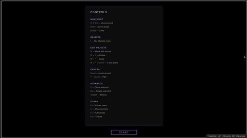

  
  
  <h1 align="center">GAME ENGINE BUILD</h1>
  <h3 align="center"> A Fɪʀsᴛ-Pᴇʀsᴏɴ 3D Sᴀɴᴅʙᴏx Eɴɢɪɴᴇ ᴀɴᴅ Tᴇxᴛᴜʀᴇ Pʀᴏᴊᴇᴄᴛᴏʀ </h3>

  <!-- TOP PURPLE LINKS -->
  
  
  
   
  <!-- BOTTOM GOLD TAXONOMY -->
  
  
  
  

  
<i>A first-person 3D sandbox engine allowing users to build with primitives and project live Datacore components onto surfaces as dynamic textures.</i>

---

## 📌 Introduction & Overview

**Game Engine Build** is an interactive, first-person 3D sandbox environment running natively inside Obsidian notes via the Datacore engine. Leveraging WebGL, it provides an immersive, game-like control scheme for navigation and building. 

Users can spawn 3D primitive shapes (cubes, pyramids, panes) and dynamically manipulate their position, rotation, and non-uniform scale directly inside the viewport. In addition, the engine supports dynamic texturing: you can apply local images, vector Lottie animations, or project live Datacore `ViewComponent` elements onto the surfaces of spawned 3D panes.

---

## ✨ Features

### 🎮 Immersive Controls & Physics
* **First-Person Viewport**: Standard WASD keyboard navigation combined with mouse camera looking, pointer-lock control, sprinting, and gravity-backed jump physics.
* **Full-Tab Leaf Projection**: Designed to run edge-to-edge by expanding out of its leaf boundary and auto-positioning, with a clean compact mode fallback.

### 🧱 Direct Object Manipulation
* **Non-Uniform Scaling**: Manipulate objects in real-time. Use key combinations (`⌘ + ⌃ + Drag` or `⌘ + ⌃ + Scroll`) to scale individual X, Y, and Z coordinate axes independently.
* **Clone & Delete**: Clone existing objects by holding `C` and dragging the clone to its new position, or delete unwanted objects pointed at by your crosshairs using `Delete`.

### 🖼️ Advanced Dynamic Texturing
* **Dynamic Lottie Vector Projections**: Apply Lottie JSON animation files onto spawned 3D panes. The engine handles canvas updates and maps the animation frame-by-frame.
* **Component-in-Component Rendering**: Load live Datacore views dynamically by filename. The engine renders them to an offscreen DOM container and textures them onto surfaces, utilizing `html2canvas` updates.

---

## 📦 Directory Index & Components

The package exposes the following compiled files:

| File | Description |
| :--- | :--- |
| **[GAME ENGINE BUILD.md](GAME%20ENGINE%20BUILD.md)** | The main Obsidian note entry point configured with declarative frontmatter. |
| **[_RESOURCES/DATACORE/_DONE/GAME ENGINE BUILD/src/index.jsx](_RESOURCES/DATACORE/_DONE/GAME%20ENGINE%20BUILD/src/index.jsx)** | The dynamic bootstrapper script that loads the application interface. |
| **[_RESOURCES/DATACORE/_DONE/GAME ENGINE BUILD/src/App.jsx](_RESOURCES/DATACORE/_DONE/GAME%20ENGINE%20BUILD/src/App.jsx)** | The core UI orchestrator holding overlays, HUD layout, and main game loop. |
| **[src/utils/webglHelpers.js](src/utils/webglHelpers.js)** | High-performance WebGL shader, buffer configuration, and matrix math helper. |
| **[src/utils/inputListeners.js](src/utils/inputListeners.js)** | Global event listener controller mapping keyboard, mouse pointer, and touch inputs. |
| **[src/utils/gameHelpers.js](src/utils/gameHelpers.js)** | Object spawning, Lottie media, and offscreen canvas texturing helper. |
| **[METADATA.md](_RESOURCES/DATACORE/_DONE/GAME%20ENGINE%20BUILD/METADATA.md)** | YAML taxonomy manifest mapping component settings, compatibility, and target. |
| **[CONTRIBUTION.md](_RESOURCES/DATACORE/_DONE/GAME%20ENGINE%20BUILD/CONTRIBUTION.md)** | Engineering standards and contributor guidelines. |
| **[LICENSE.md](_RESOURCES/DATACORE/_DONE/GAME%20ENGINE%20BUILD/LICENSE.md)** | The MIT permissible software distribution license. |
| **[assets/gameenginebuild.clip.gif](assets/gameenginebuild.clip.gif)** | Optimised high-fidelity Lanczos loop animation demonstrating engine features. |
